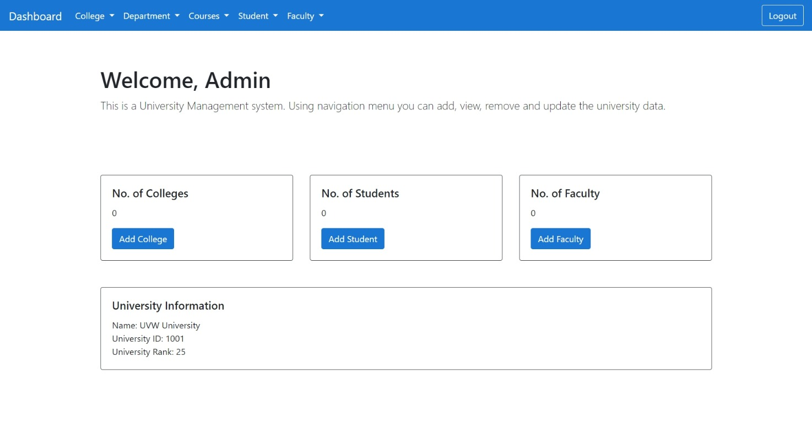

# UMS: University Management System

### A transparent and user-friendly University Management System. This project was created as a part of the Semester-5-DBMS mini-project.

<br/>

## Project Structure: 
```
.
├── assets
|   ├── css
│   └── database
├── helpers
│   ├── config.php
│   └── check_session.php
├── process
|   └── 
├── views
│   └── 
└── index.php

```

(For more visit: [about project structure](https://codeburst.io/how-to-maintain-core-php-projects-594721858cad "Maintain core PHP projects"))

<br/>

## Installation Guide: (Windows)

### XAMPP: 
- Install [XAMPP](https://www.apachefriends.org/index.html "XAMPP") (version 7.4.10+)
- Run XAMPP Control Panel
- Move the project folder in *xampp/htdocs/*


### Database: (Data Model -> [DModel](assets/dmodel/dmodel.pdf))
- Change the [*config.php*](helpers/config.php) 
- Open *localhost/phpmyadmin* in browser
- Create a new database with name *UMS*, then import the [Database](assets/database/ums.sql) 

### Run:
- Open browser -> *localhost/UMS/index.php*
- Default user:
    - Username: Admin
    - Password: Admin

<br/>

### Screenshots:
Login page:


Dashboard page:




